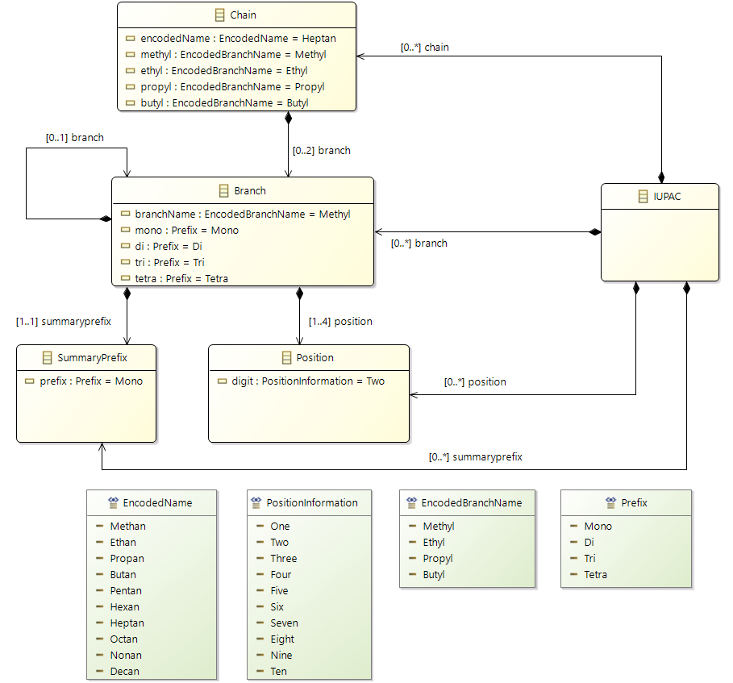
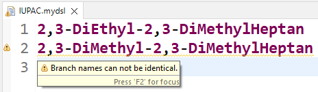

# DSLdesign – Xtext Tutorial Project

This repository contains an example project for developing a **Domain-Specific Language (DSL)** using [Xtext](https://www.eclipse.org/Xtext/).  
It is based on the book *Domain-Specific Languages: Effective Modeling, Automation, and Reuse* by Wąsowski & Berger (2023) and the accompanying **Xtext tutorial**.

## Contents

- **Xtext Grammar**  
  Contains the definition of an example DSL developed with Xtext (including parser, editor, and code generation).
  
- **Ecore Model**  
  The metamodel that defines the abstract syntax.

- **Generated Editor**  
  Comes with syntax highlighting, code completion (Ctrl+Space), and validation rules.

- **OCL Examples**  
  Static semantic checks with OCL (e.g., consistency rules, naming conventions).

- **Use Cases**  
  Example applications of the DSL, including:
  - Validation of inputs  
  - Categorization of IUPAC names  
  - Extending the metamodel with additional structures

## Requirements

- **Eclipse IDE** with the following plugins:
  - [Xtext](https://www.eclipse.org/Xtext/download.html)  
  - EMF (Eclipse Modeling Framework)
- Java 11 or higher
- Maven (optional, if build integration is needed)

## Installation & Usage

1. Clone the repository:
   ```bash
   git clone https://github.com/Masu98s/Dsldesign.git
   ```
2. Import the project into Eclipse:  
   `File → Import → Existing Projects into Workspace`
3. Generate Xtext artifacts:  
   Right-click the `.xtext` file → **Run As → Generate Xtext Artifacts**
4. Start the DSL editor:  
   Right-click the main project → **Run As → Eclipse Application**
5. Create a new DSL file:  
   - Create a new project  
   - Add a file with the extension `.mydsl`  
   - Test autocompletion using `Ctrl+Space`

## Examples

A simple input in the DSL could look like this:

```
2-MonoMethylButan
```

The editor automatically checks whether the syntax and semantics (e.g., positions, prefixes) are valid.

### Example Screenshots

**Metamodel of the IUPAC example**  


**Generated Xtext editor with autocompletion**  


**Validation of syntactic errors in the editor**  


## References

- Andrzej Wąsowski & Thorsten Berger (2023):  
  *Domain-Specific Languages: Effective Modeling, Automation, and Reuse.* Springer Nature.  
  [Website](http://dsl.design) | [Supplementary Material](https://bitbucket.org/dsldesign/dsldesign)
- Xtext Documentation: [https://www.eclipse.org/Xtext/documentation/](https://www.eclipse.org/Xtext/documentation/)
